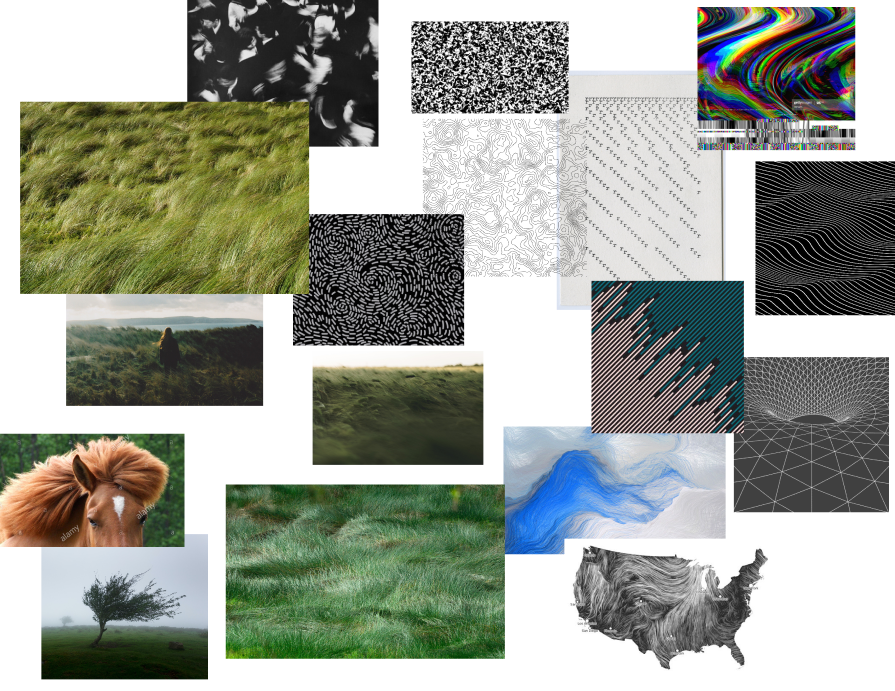

# Crative_Code Projekt

## Moodboard zum Thema Wind 

---

## Konzept und Idee

Meine Idee ist es Grashalme im Wind darzustellen. Die Maus führt die Windrichtung an, die sich beim herumfahren verändert.
Mit dem GUI-Regler steuert man die Windstärke die anhand der Strichlänge verdeutlicht wird. Um etwas Dynamik in das Grundbild zu bringen,
verändert sich der Hintergrund anhand der aktuellen Sekunden, was einen Eindruck von Tag zu Nacht schenkt. Da in der Nacht die Grashalme
schlecht zu erkennen ist, kann man mit gedrückter Maus den Modus der Gräser verändern, so dass die im dunkeln leuchten.
